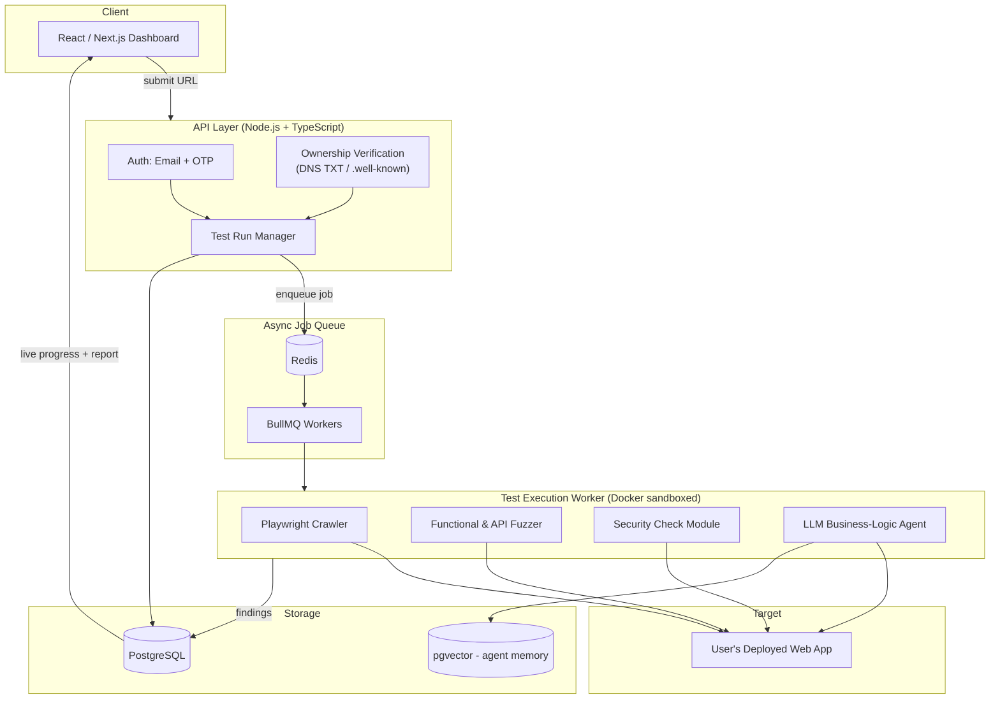
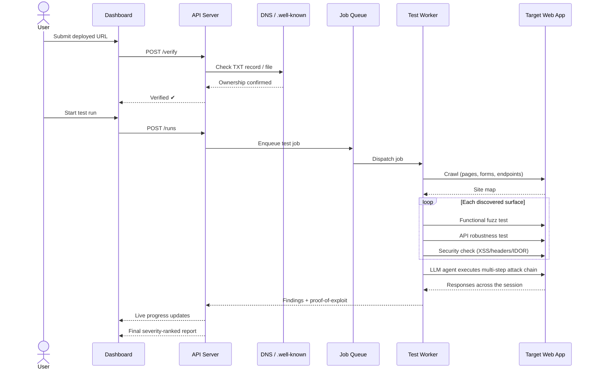

# BreakBot

**Workflow-aware web app security & QA tester.**

BreakBot crawls your deployed web app, verifies you actually own it, and then runs
automated attacks against it — not just field-by-field fuzzing like traditional
scanners, but multi-step, stateful "business logic" attack chains driven by an
LLM agent that understands what your app's workflows are actually trying to do.

> Most DAST tools test individual inputs. BreakBot tests your workflows.

---

## Table of Contents

- [Problem](#problem)
- [What BreakBot Does](#what-breakbot-does)
- [Who It's For](#who-its-for)
- [Architecture](#architecture)
- [Test Run Flow](#test-run-flow)
- [Tech Stack](#tech-stack)
- [Getting Started](#getting-started)
- [Repo Structure](#repo-structure)
- [Roadmap](#roadmap)
- [Out of Scope (v1)](#out-of-scope-v1)
- [Success Metrics](#success-metrics)
- [License](#license)

---

## Problem

Most developers and small teams ship web apps without any adversarial testing
beyond manual QA. Existing DAST tools (OWASP ZAP, Burp Suite, Acunetix) are
powerful but heavy, enterprise-oriented, and largely **stateless and syntactic**
— they fire known payloads at individual fields and pattern-match the response.

None of them reason about what the app is actually *for*. A checkout flow isn't
just a set of independent inputs — it's a sequence of steps with state that
carries between them, and that's exactly where real business-logic bugs live
(price tampering between steps, replayed payments, walking sequential order IDs
to view someone else's data).

## What BreakBot Does

1. **Verify ownership** — DNS TXT record or `/.well-known/` file challenge.
   No test run starts until this passes.
2. **Crawl** — a headless browser maps every page, form, and discovered API
   endpoint.
3. **Test**, in layers:
   - Functional fuzzing (boundary values, malformed input, wrong types)
   - API robustness (malformed JSON, wrong verbs, missing auth)
   - Non-destructive security checks (reflected XSS, security headers, cookie
     flags, IDOR, CSRF token presence)
   - **LLM-driven business-logic attack chains** — the core differentiator:
     an agent reasons over the crawled site and executes multi-step, stateful
     attacks a single-request fuzzer would never find.
4. **Report** — every finding ships with a reproducible proof-of-exploit: the
   exact request/response pair and a replayable `curl` command. No proof, no
   finding.

## Who It's For

**Primary:** indie developers, small startups, and student/hobby teams who want
a pre-launch security and robustness check but can't justify an enterprise DAST
tool or a manual pentest.

**Secondary:** bootcamp/college teams wanting an automated sanity pass before a
capstone demo or submission.

**Explicitly not for:** enterprise teams needing compliance reporting or full
CVE/signature-database breadth (Burp/Checkmarx/Invicti already own that), and
anyone who can't prove ownership of the target.

---

## Architecture



## Test Run Flow



---

## Tech Stack

| Layer | Technology |
|---|---|
| Frontend | React, Next.js, TypeScript, Tailwind CSS, Recharts/D3.js, Socket.io/SSE |
| Backend | Node.js, TypeScript, Express/Fastify, PostgreSQL, Prisma/Drizzle |
| Queue | Redis, BullMQ |
| Crawling & Execution | Playwright, Docker (sandboxed per run), axios/undici |
| LLM Agent | OpenAI/Anthropic API or local Ollama, LangChain or custom agent loop, pgvector |
| Infra | Docker Compose, Kubernetes + Helm, Terraform, GitHub Actions, Grafana + Prometheus |
| Auth & Verification | Email + OTP, Node `dns` module, `/.well-known/` file check |
| Testing | Jest/Vitest, OWASP Juice Shop (ground-truth benchmark), Playwright Test |

---

## Getting Started

```bash
# clone
git clone https://github.com/ayuxh16/BreakBot.git
cd BreakBot

# local dev environment
docker compose up -d        # Postgres + Redis
npm install
npx playwright install      # browser binaries for the crawler

# run services
npm run dev:api
npm run dev:web
npm run dev:worker
```

> Full environment variable list and cloud setup instructions coming as the
> project is built out — see `requirements.txt` for the full spec in the
> meantime.

## Repo Structure

```
/apps
  /web         -> Next.js dashboard
  /api         -> Node/TS backend
  /worker      -> test-execution worker (Playwright + fuzzers + LLM agent)
/packages
  /shared      -> shared types between api/web/worker
/infra
  /terraform   -> cloud provisioning
  /helm        -> k8s chart definitions
/.github/workflows -> CI pipelines (including Juice Shop benchmark run)
```

## Roadmap

- [ ] Domain ownership verification (DNS TXT / `.well-known`)
- [ ] Crawler + functional fuzzing
- [ ] API robustness testing
- [ ] Security check module (OWASP Top 10 subset)
- [ ] LLM business-logic agent (multi-step attack chains)
- [ ] Live dashboard + severity-ranked report
- [ ] Kubernetes horizontal scaling for concurrent test runs
- [ ] Validation against OWASP Juice Shop as ground truth

## Out of Scope (v1)

- Government ID / KYC verification of any kind
- Compliance reporting (SOC2, PCI-DSS style)
- Mobile / native app testing
- Full CVE/signature-database parity with commercial tools
- Destructive/irreversible testing by default

## Success Metrics

- Correctly identifies seeded vulnerabilities in OWASP Juice Shop
- Full flow works end-to-end with no manual intervention: submit → verify →
  test → report
- At least one demonstrated multi-step business-logic attack chain that a
  single-request fuzzer would miss

---

## License

TBD.